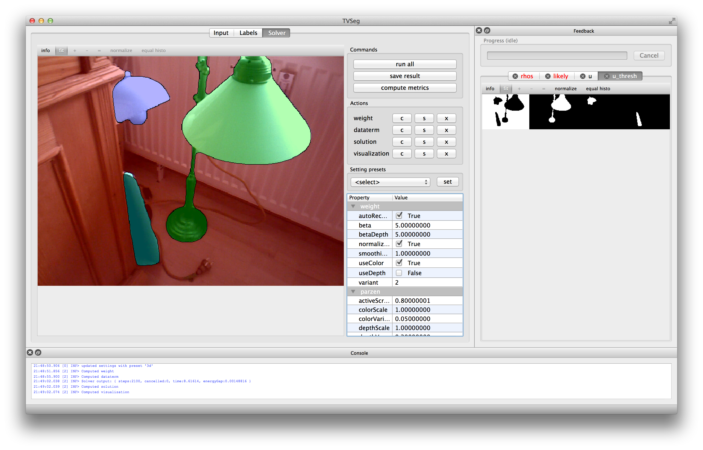

# TVSEG

variational image segmentation

## Introduction

The tvseg software is a library and GUI tool image segmentation. For now we
implement interactive image segmentation based on spatially-varying color and
depth distributions.



## Getting started

`tvseg` is platform independent in principle, but so far has only been developed
and tested on Mac OS X 10.9.

### Dependencies

You will need `boost`, `opencv`, `Qt 5` and `CUDA` (tested with version 6.0).

#### Mac OS X

Due to issues of CUDA with the clang compiler and `libc++`, out of the box
`tvseg` will look for special versions of the above libraries, linked against
`libstdc++`, which you can install using [Homebrew](http://brew.sh/) from my
[custom Tap](https://github.com/NikolausDemmel/homebrew-devel)

```
brew install NikolausDemmel/devel/boost-libstdcxx
brew install NikolausDemmel/devel/opencv-libstdcxx.rb
brew install NikolausDemmel/devel/qt5-libstdcxx.rb
```

Alternatives, like using GCC will require you to manually tweak the
[tvseg.pro](tvseg.pro) file.

With all dependencies installed, you should be able to open the project in
[QtCreator](http://qt-project.org/) and compile it.

### Other platforms

In order to get tvseg to compile and run a little bit of manual tweaking of the
[tvseg.pro](tvseg.pro) project file is currently necessary. We hope to support
at least Linux out of the box in the future.

## Contribution

Please fork, hack away and send pull requests.

See [AUTHORS.md](AUTHORS).

## Documentation

### Screencasts

TODO

### Parameter file description

An overview over the parameters that can be set in the `settings.ini` and
through the GUI can be found in documentation for [settings](doc/settings.md).

### Theory

There is a [report](doc/pdf/demmel2014idp_report_small.pdf) describing spatially
varying color and depth distributions as implemented by tvseg and an
accompanying set of [slides](doc/pdf/demmel2014idp_slides_small.pdf).

### Code structure overview ###

The following gives a high-level overview over the code structure. In general
the software is structured to distinguish between the Qt GUI and the core
library with all algorithms. The library is independent from Qt (at the time of
writing this is not quite true, but that is at least the intention) and uses
Boost and OpenCV and the STL, so there is some amount of data conversion going
on between library and GUI, but this is aided by helper functions.

There is fair amount of boilerplate code that is necessary for
* making a clean interface between GUI and library, while the former is using Qt
  data structures, while the latter is relying on STL and Boost;
* dealing with the oddities of CUDA with clang; even when using `libstdc++`,
  CUDA chokes on some includes like Bosst.Assert (which implies also e.g. Boost
  `shared_ptr`) or OpenCV, meaning we have to make sure non of those headers are
  included in the definition of any data structure that we mean to pass down to
  CUDA code;
* facilitating parts of the code base that are envisioned to be more general
  than they currently are implemented. For example the `CVAlgorithmInterface`
  and `AlgorithmWidget` do not make perfect sense in their currently fairly
  limited use/implementation.

The source file layout is as follows:

* [`lib/`](lib) contains the tvseg library and some 3rdparty libraries
    * [`tvseg/`](lib/tvseg)
        * [`cuda/`](lib/tvseg/cuda) CUDA implementation of parallelized algorithms
        * [`settings/`](lib/tvseg/settings) an setting system that uses template
          and macro magic to let the user easily define settings in the
          `settings.ini` file. Code for setting and parameter data structures
          are generated. The latter are PODs that can be passed to CUDA code.
        * [`settingsdef/`](lib/tvseg/settingsdef) actual definitions of various
          setting groups. Look here for examples on how to define additional
          settings.
        * [`util/`](lib/tvseg/util)
        * [`cvalgorithminterface.h`](lib/tvseg/cvalgorithminterface.h)
        * [`segmentation.h`](lib/tvseg/segmentation.h)
        * [`segmentationimpl.h`](lib/tvseg/segmentationimpl.h)
        * [`tvdataterm.h`](lib/tvseg/tvdataterm.h), [`tvsolver.h`](lib/tvseg/tvsolver.h), [`tvvisualizer.h`](lib/tvseg/tvvisualizer.h), [`tvweight.h`](lib/tvseg/tvweight.h)
* [`src/`](src) contains the tvseg Qt GUI
    * [`tvsegwindow.h`](src/tvsegwindow.h) is the main application window. Most of the high-level
      GUI functionality is implemented there.
    * [`settingseditor.h`](src/settingseditor.h)
    * [`imagewidget.h`](src/imagewidget.h)
    * [`cvimagedisplaywidget.h`](src/cvimagedisplaywidget.h)
    * [`scribbleimagedisplaywidget.h`](src/scribbleimagedisplaywidget.h)
    * [`algorithmwidget.h`](src/algorithmwidget.h)

## LICENSE

This repository contains modified version of various software libraries for
which you might have to consider the original license (this list is not
necessarily exhaustive):

project | files | license
--- | --- | ---
Boost: Enum, Fusion    | [`lib/boost/`](lib/boost), [`lib/tvseg/settings/defineparams.h`](lib/tvseg/settings/defineparams.h)    | [Boost License](http://www.boost.org/LICENSE_1_0.txt)
Easylogging++          | [`lib/tvseg/3rdparty/`](lib/tvseg/3rdparty)                                                            | [MIT license](http://easylogging.org/licence.php)
NVIDIA CUDA samples    | [`lib/tvseg/cuda/errorhandling.h`](lib/tvseg/cuda/errorhandling.h), [`lib/cuda_samples/`](lib/cuda_samples)    | [CUDA samples EULA](http://developer.download.nvidia.com/compute/cuda/5_5/rel/docs/EULA.pdf)
rosconsole             | [`lib/tvseg/util/logging.h`](lib/tvseg/util/logging.h)                                                 | [BSD license](http://wiki.ros.org/ros_comm)
QtPropertyBrowser      | [`src/3rdparty/qtpropertybrowser/`](src/3rdparty/qtpropertybrowser)                                    | BSD license: see source files
MatLab scripts from the NYU2 dataset toolbox    | [`image_capture/`](image_capture)                                             | [website](http://cs.nyu.edu/~silberman/datasets/nyu_depth_v2.html)

All original code in the tvseg project is licensed under a BSD license:

```
Copyright (c) 2013, 2014, Nikolaus Demmel
All rights reserved.

Redistribution and use in source and binary forms, with or without modification,
are permitted provided that the following conditions are met:

1. Redistributions of source code must retain the above copyright notice, this
list of conditions and the following disclaimer.

2. Redistributions in binary form must reproduce the above copyright notice,
this list of conditions and the following disclaimer in the documentation and/or
other materials provided with the distribution.

THIS SOFTWARE IS PROVIDED BY THE COPYRIGHT HOLDERS AND CONTRIBUTORS "AS IS" AND
ANY EXPRESS OR IMPLIED WARRANTIES, INCLUDING, BUT NOT LIMITED TO, THE IMPLIED
WARRANTIES OF MERCHANTABILITY AND FITNESS FOR A PARTICULAR PURPOSE ARE
DISCLAIMED. IN NO EVENT SHALL THE COPYRIGHT HOLDER OR CONTRIBUTORS BE LIABLE FOR
ANY DIRECT, INDIRECT, INCIDENTAL, SPECIAL, EXEMPLARY, OR CONSEQUENTIAL DAMAGES
(INCLUDING, BUT NOT LIMITED TO, PROCUREMENT OF SUBSTITUTE GOODS OR SERVICES;
LOSS OF USE, DATA, OR PROFITS; OR BUSINESS INTERRUPTION) HOWEVER CAUSED AND ON
ANY THEORY OF LIABILITY, WHETHER IN CONTRACT, STRICT LIABILITY, OR TORT
(INCLUDING NEGLIGENCE OR OTHERWISE) ARISING IN ANY WAY OUT OF THE USE OF THIS
SOFTWARE, EVEN IF ADVISED OF THE POSSIBILITY OF SUCH DAMAGE.
```
